# Municeo — Spécifications complètes

**Version** : 1.1  
**Date** : Mars 2026  
**Porteur initial** : Franck (initiative personnelle)  
**Statut** : Projet open source — MVP financé à titre personnel, gouvernance associative envisagée  
**Licence** : AGPL-3.0  
**Dépôt** : github.com/[username]/municeo

---

## Table des matières

1. [Vision du projet](#1-vision-du-projet)
2. [Stack technique](#2-stack-technique)
3. [Architecture applicative](#3-architecture-applicative)
4. [Modèle de données](#4-modèle-de-données)
5. [ValueObjects et Enums](#5-valueobjects-et-enums)
6. [Règles métier](#6-règles-métier)
7. [TrustScore et niveaux citoyens](#7-trustscore-et-niveaux-citoyens)
8. [Système anti-abus](#8-système-anti-abus)
9. [Notifications](#9-notifications)
10. [Authentification et droits](#10-authentification-et-droits)
11. [Frontend et PWA](#11-frontend-et-pwa)
12. [Open source et licence](#12-open-source-et-licence)
13. [Paramètres configurables](#13-paramètres-configurables)
14. [Use cases détaillés](#14-use-cases-détaillés)
15. [Diagrammes de séquence](#15-diagrammes-de-séquence)
16. [Diagrammes d'état](#16-diagrammes-détat)
17. [Ordre de développement — MVP](#17-ordre-de-développement--mvp)
18. [Points d'attention techniques](#18-points-dattention-techniques)

---

## 1. Vision du projet

Municeo est un outil participatif open source permettant aux habitants d'une commune de signaler des incivilités et problèmes du quotidien (dépôts d'ordures sauvages, voirie dégradée, éclairage défectueux, etc.) directement à leur municipalité.

L'objectif premier est de **redonner de la voix aux habitants** tout en évitant au maximum les dérives possibles. L'outil repose sur un aspect communautaire sain : pas de commentaires libres entre citoyens, un score de confiance transparent, et des mécanismes de vote simples et objectifs.

Les signalements sont une **première étape** vers une implication plus large de la population dans la vie de leur commune. L'architecture doit rester ouverte à des évolutions futures sans sur-ingénierie immédiate.

### Contexte du projet

Projet porté à titre personnel par son créateur. MVP développé et financé de manière indépendante. Gouvernance associative envisagée pour assurer la pérennité à terme.

En tant que projet open source, Municeo a vocation à être librement déployable par toute commune, ouvert aux contributions, transparent dans ses décisions, et non commercial — aucune monétisation des données citoyennes.

---

## 2. Stack technique

| Couche | Choix |
|---|---|
| Langage | PHP 8.5+ |
| Framework | Symfony 8.0+ (migration 8.4 LTS prévue nov. 2026) |
| Serveur | FrankenPHP (mode worker, Caddy intégré) |
| Frontend | Twig + Symfony UX (Stimulus, Turbo) |
| Base de données | PostgreSQL 18+ |
| Extension géospatiale | PostGIS 3.6+ (GEOS 3.14+) |
| ORM | Doctrine + `jsor/doctrine-postgis` (compatible PostGIS 3.6+) |
| Authentification | Symfony Security (3 firewalls) |
| Temps réel | Mercure (SSE) |
| Stockage photos | Local (`public/uploads/`) |
| Email | Symfony Mailer |
| Tâches planifiées | Symfony Messenger + Scheduler |
| Tests | PHPUnit |
| PWA | Manifest + Service Worker minimal |
| CI/CD | GitHub Actions |
| Licence | AGPL-3.0 |

### 2.1 Notes sur FrankenPHP

FrankenPHP remplace PHP-FPM + Nginx/Apache. Il tourne en **mode worker** avec Caddy intégré, ce qui implique :

- Le processus PHP reste en mémoire entre les requêtes (pas de cold start)
- La configuration se fait via `FRANKENPHP_CONFIG` et un fichier `Caddyfile`
- Le Dockerfile cible l'image `dunglas/frankenphp`
- Gains de performance mesurés : 3–4× vs PHP-FPM pour les workloads Symfony

**Note Symfony 8.0 / 8.4 :** Symfony 8.0 est une version standard (support jusqu'en juillet 2026). La migration vers **Symfony 8.4 LTS** (prévue novembre 2026, support jusqu'en novembre 2029) est planifiée dès sa sortie. L'architecture du projet est pensée pour rendre cette migration transparente.

### 2.2 Bénéfices PostgreSQL 18 pour Municeo

- **Asynchronous I/O (AIO)** — jusqu'à 3× plus rapide pour les lectures, bénéfique pour les requêtes géospatiales
- **`uuidv7()` natif** — UUID ordonné dans le temps, utilisé comme PK sur toutes les entités
- **Colonnes générées virtuelles** — calculs à la lecture sans stockage supplémentaire
- **OAuth 2.0** — intégration future avec des fournisseurs d'identité si besoin

---

## 3. Architecture applicative

### 3.1 Séparation des couches

| Couche | Contenu |
|---|---|
| Domain | Entités, ValueObjects, Events, Exceptions, Interfaces Repository |
| Application | Commands, Handlers, Queries |
| Infrastructure | Persistence, Http, Mercure, Mailer, Scheduler, Storage |

### 3.2 Structure des dossiers

```
src/
├── Domain/
│   ├── Report/
│   │   ├── Entity/        Report, ReportVote, AgentValidation
│   │   ├── ValueObject/   Coordinates, ReportStatus, ReportId,
│   │   │                  VoteValue, WilsonScore
│   │   ├── Service/       WilsonScoreCalculator
│   │   ├── Event/         ReportCreated, ReportVoted, ReportValidated,
│   │   │                  ReportResolved, ReportRejected, ReportArchived
│   │   ├── Exception/     DuplicateReport, DailyLimit, Cooldown,
│   │   │                  DuplicateVote, InvalidTransition
│   │   └── Repository/    ReportRepositoryInterface
│   └── User/
│       ├── Entity/        User
│       ├── ValueObject/   TrustScore, CitizenLevel, UserRole,
│       │                  AbuseReason, EncryptedEmail
│       ├── Service/       TrustScoreCalculatorInterface
│       ├── Event/         UserBlocked, UserDeleted
│       ├── Exception/     UserBlockedException
│       └── Repository/    UserRepositoryInterface
├── Application/
│   ├── Report/
│   │   ├── Command/       CreateReport, VoteReportResolved, ValidateReport,
│   │   │                  ResolveReport, RejectReport, ArchiveExpiredReports
│   │   ├── Handler/       (un handler par command)
│   │   └── Query/         GetReportsNearLocation, GetReportsByStatus
│   └── User/
│       ├── Command/       RegisterAnonymousUser
│       └── Handler/       RegisterAnonymousUserHandler
└── Infrastructure/
    ├── Persistence/Doctrine/Repository/
    ├── Http/Controller/   Report/, Agent/, Admin/
    ├── Http/Responder/
    ├── Mercure/
    ├── Notification/
    ├── Messenger/Message/
    ├── Scheduler/
    └── Storage/
```

---

## 4. Modèle de données

### 4.1 Entité `Report`

| Champ | Type | Contraintes |
|---|---|---|
| `id` | UUID | PK |
| `user` | FK User | NOT NULL |
| `category` | enum | `WASTE`, `ROAD`, `LIGHTING`, `OTHER` |
| `description` | text | nullable |
| `photo_path` | string | NOT NULL |
| `location` | Point (PostGIS) | NOT NULL |
| `status` | enum | voir ReportStatus |
| `created_at` | datetime | NOT NULL |
| `archived_at` | datetime | nullable |

### 4.2 Entité `ReportVote`

| Champ | Type | Contraintes |
|---|---|---|
| `id` | UUID | PK |
| `report` | FK Report | NOT NULL |
| `user` | FK User | NOT NULL |
| `value` | int | +1 ou -1 |
| `created_at` | datetime | NOT NULL |

Contrainte unique : `(user_id, report_id)` — un seul vote par utilisateur par signalement.

### 4.3 Entité `AgentValidation`

| Champ | Type | Contraintes |
|---|---|---|
| `id` | UUID | PK |
| `report` | FK Report | NOT NULL |
| `agent` | FK User | NOT NULL |
| `photo_path` | string | NOT NULL (photo horodatée) |
| `taken_at` | datetime | NOT NULL |
| `comment` | text | NOT NULL |
| `is_public` | bool | true (visible citoyens) |
| `created_at` | datetime | NOT NULL |

### 4.4 Entité `User`

| Champ | Type | Contraintes |
|---|---|---|
| `id` | UUID | PK |
| `username` | string | généré aléatoirement |
| `email` | string | chiffré (AES) |
| `password` | string | hashé (argon2) |
| `roles` | array | `ROLE_CITIZEN`, `ROLE_AGENT`, `ROLE_ADMIN` |
| `trust_score` | int | défaut 0 |
| `abuse_count` | int | défaut 0 |
| `blocked_until` | datetime | nullable |
| `deleted_at` | datetime | nullable (soft delete) |
| `created_at` | datetime | NOT NULL |

---

## 5. ValueObjects et Enums

### 5.1 `ReportStatus`

```php
enum ReportStatus: string
{
    case PENDING   = 'pending';    // publié, en cours
    case VALIDATED = 'validated';  // validé terrain par agent
    case RESOLVED  = 'resolved';   // clôturé
    case REJECTED  = 'rejected';   // rejeté par agent
    case ARCHIVED  = 'archived';   // archivé (30 jours)
}
```

### 5.2 `CitizenLevel`

```php
enum CitizenLevel: string
{
    case HABITANT        = 'habitant';        // 0 – 4
    case CITOYEN         = 'citoyen';         // 5 – 14
    case CITOYEN_ENGAGE  = 'citoyen_engage';  // 15 – 29
    case PILIER_QUARTIER = 'pilier_quartier'; // 30+
}
```

Dérivé du TrustScore — jamais stocké en base. Méthode `getLevel(): CitizenLevel` sur le VO `TrustScore`.

### 5.3 `VoteValue`

```php
enum VoteValue: int { case UP = 1; case DOWN = -1; }
```

### 5.4 `AbuseReason`

```php
enum AbuseReason: string
{
    case RATE_LIMIT_EXCEEDED = 'rate_limit_exceeded';
    case COOLDOWN_BYPASSED   = 'cooldown_bypassed';
    case NEGATIVE_WILSON     = 'negative_wilson_score';
}
```

### 5.5 `WilsonScore`

VO calculé à la demande, jamais stocké en base. Formule (95%, z = 1.96) :

```
p_hat  = votes_positifs / total_votes
wilson = (p_hat + z²/2n - z√(p̂(1-p̂)/n + z²/4n²)) / (1 + z²/n)
```

### 5.6 `EncryptedEmail`

Chiffré AES à la persistance. Déchiffré uniquement au moment de l'envoi d'email. Jamais loggué en clair.

---

## 6. Règles métier

### 6.1 Création d'un signalement

Tout signalement est publié **immédiatement en PENDING**. Ordre de vérification dans `CreateReportHandler` :

1. Utilisateur bloqué ? → `UserBlockedException`
2. Rate limit ? → `ReportDailyLimitExceededException` + `abuseCount++`
3. Cooldown ? → `ReportCooldownException` + `abuseCount++`
4. Doublon géographique ? → `DuplicateReportException` (ST_DWithin)
5. Création en statut `PENDING`

### 6.2 Doublon géographique

```sql
ST_DWithin(location, ST_Point(:lng, :lat)::geography, :radius)
```

### 6.3 Cycle de vie

```
PENDING  →  VALIDATED  →  RESOLVED
         ↘  REJECTED
         ↘  ARCHIVED (30 jours)
```

| Transition | Acteur | Conditions |
|---|---|---|
| `PENDING → VALIDATED` | Agent | Photo horodatée + commentaire |
| `VALIDATED → RESOLVED` | Agent | Clôture terrain |
| `PENDING → REJECTED` | Agent | Motif obligatoire |
| `PENDING → ARCHIVED` | Scheduler | 30 jours sans action |

### 6.4 Votes communautaires

Un vote par citoyen par signalement. Compteur non visible. Wilson Score recalculé à chaque vote.

| Seuil Wilson | Effet |
|---|---|
| >= `wilson_alert_threshold` | Alerte agents |
| >= 0.6 | TrustScore auteur +2 |
| <= 0.3 | TrustScore auteur -1 |
| <= 0.2 | abuseCount auteur +1 |

### 6.5 Résolution

- **Citoyen** : commentaire obligatoire, seuil interne pondéré par niveau, non communiqué
- **Agent** : immédiate, sans seuil, prévaut sur tout vote en cours

### 6.6 Validation terrain

Photo horodatée + commentaire obligatoires. Preuve publiquement visible sur la fiche.

### 6.7 Archivage

Scheduler quotidien — signalements `PENDING` > 30 jours → `ARCHIVED`.

---

## 7. TrustScore et niveaux citoyens

| Événement | Delta | Source |
|---|---|---|
| Wilson >= 0.6 | +2 | Communauté |
| Wilson <= 0.3 | -1 | Communauté |
| Signalement VALIDATED | +3 | Agent (prévaut) |
| Signalement REJECTED | -4 | Agent (prévaut) |
| Signalement RESOLVED | +1 | Agent |

| Score | Niveau | Avantages |
|---|---|---|
| 0–4 | Habitant | Accès standard |
| 5–14 | Citoyen | Accès standard |
| 15–29 | Citoyen engagé | Vote résolution poids x1.5 |
| 30+ | Pilier de quartier | Poids x1.5 + badge visible |

---

## 8. Système anti-abus

| Déclencheur | Moment |
|---|---|
| Rate limit dépassé | `CreateReportHandler` |
| Cooldown non respecté | `CreateReportHandler` |
| Wilson <= 0.2 | `ReportVoteHandler` |

```
abuseCount += 1
abuseCount < 3  → blockedUntil = now + 72h + email
abuseCount >= 3 → UserDeletedEvent → soft delete + email final
```

Agents : aucune maîtrise sur les utilisateurs. Sanctions automatiques uniquement.

---

## 9. Notifications

```
Clôture agent → ReportResolved
  → Mercure push /users/{userId}/notifications (immédiat)
  → Email fallback Messenger +5 min

Wilson >= seuil → Mercure push /agents/alerts (immédiat)
               → Email agents Messenger +5 min
```

---

## 10. Authentification et droits

```yaml
firewalls:
    admin:  pattern: ^/admin   # ROLE_ADMIN
    agent:  pattern: ^/agent   # ROLE_AGENT
    main:   pattern: ^/        # ROLE_CITIZEN
```

| Action | CITIZEN | AGENT | ADMIN |
|---|---|---|---|
| Créer un signalement | ✓ | — | — |
| Voter | ✓ | — | — |
| Signaler résolution | ✓ | — | — |
| Voir tous signalements | ✓ | ✓ | ✓ |
| Valider terrain | — | ✓ | — |
| Clôturer / Rejeter | — | ✓ | — |
| Voir utilisateurs | — | — | ✓ |
| Créer comptes agents | — | — | ✓ |
| Export / config | — | — | ✓ |
| Bloquer/supprimer user | — | — | Système auto |

---

## 11. Frontend et PWA

- Twig + Symfony UX (Stimulus, Turbo Drive)
- Stimulus : GPS (`navigator.geolocation`) et caméra (`<input type="file" accept="image/*" capture="environment">`)
- PWA : Manifest JSON + Service Worker minimal

---

## 12. Open source et licence

### 12.1 AGPL-3.0 — choix et justification

**Pourquoi pas EUPL v1.2 ?** L'EUPL ne couvre pas le cas SaaS/réseau : un opérateur peut déployer une version modifiée en ligne sans obligation de publier ses modifications.

**Pourquoi AGPL-3.0 ?** La clause réseau (section 13) oblige quiconque exploite une version modifiée comme service accessible à des tiers à publier ses modifications.

| Cas d'usage | Obligation |
|---|---|
| Commune déploie et modifie | Publie ses modifications ✓ |
| Prestataire — instance multi-communes | Publie ses modifications ✓ |
| Acteur commercial — SaaS | Publie ses modifications ✓ |

### 12.2 Structure du dépôt

```
municeo/
├── .github/workflows/ · ISSUE_TEMPLATE/
├── src/ · tests/ · docs/ · migrations/
├── public/ · config/
├── README.md · CONTRIBUTING.md
├── CODE_OF_CONDUCT.md · SECURITY.md
└── LICENSE   # AGPL-3.0
```

---

## 13. Paramètres configurables

```yaml
parameters:
    municeo.report_daily_limit: 3
    municeo.report_cooldown_minutes: 30
    municeo.duplicate_radius_meters: 50
    municeo.archive_after_days: 30
    municeo.resolution_vote_threshold: 5
    municeo.wilson_alert_threshold: 0.65
    municeo.wilson_score_positive_threshold: 0.6
    municeo.wilson_score_negative_threshold: 0.3
    municeo.wilson_score_abuse_threshold: 0.2
    municeo.trust_score_delta_validated: 3
    municeo.trust_score_delta_rejected: -4
    municeo.trust_score_level_citoyen: 5
    municeo.trust_score_level_citoyen_engage: 15
    municeo.trust_score_level_pilier: 30
    municeo.abuse_block_duration_hours: 72
    municeo.abuse_warning_threshold: 2
    municeo.resolution_email_delay_minutes: 5
    municeo.agent_alert_email_delay_minutes: 5
```

---

## 14. Use cases détaillés

### Conventions

| Symbole | Signification |
|---|---|
| UC-XX | Identifiant use case |
| Acteur principal | Qui initie l'action |
| Préconditions | État requis avant exécution |
| Flux nominal | Chemin heureux |
| Flux alternatifs | Variantes acceptées |
| Flux d'erreur | Cas d'échec |
| Postconditions | État garanti après exécution |

---

### UC-01 — Inscription anonyme

**Acteur principal** : Visiteur non authentifié  
**Préconditions** : Aucune

**Flux nominal :**
1. Le visiteur accède à `/register`
2. Il saisit son email et choisit un mot de passe
3. Le système génère un username aléatoire (adjectif + nom + 4 chiffres, ex. `citoyen-rapide-4821`)
4. L'email est chiffré AES avant persistance
5. Le mot de passe est hashé argon2
6. Compte créé : `ROLE_CITIZEN`, `trust_score = 0`, `abuse_count = 0`
7. Session ouverte — redirection vers la carte des signalements

**Flux d'erreur :**
- E1 : Email déjà utilisé → message générique (ne pas révéler l'existence d'un compte)
- E2 : Mot de passe trop faible → rejet avec message explicatif
- E3 : Email invalide → rejet

**Postconditions :**
- Compte citoyen actif, session ouverte, username unique en base

**Règles :**
- Username généré côté serveur, non choisi par l'utilisateur
- Aucune vérification d'email (anonymat garanti)
- Email jamais affiché ni loggué en clair

---

### UC-02 — Création d'un signalement

**Acteur principal** : Citoyen authentifié  
**Préconditions** : Compte actif, non bloqué

**Flux nominal :**
1. Le citoyen accède au formulaire (bouton flottant sur la carte)
2. Sélection de la catégorie (`WASTE`, `ROAD`, `LIGHTING`, `OTHER`)
3. Photo prise ou importée (obligatoire)
4. Géolocalisation GPS activée ou position manuelle sur la carte
5. Description optionnelle
6. Soumission du formulaire
7. Vérifications serveur : blocage → rate limit → cooldown → doublon géographique
8. Signalement créé en statut `PENDING`
9. Apparaît immédiatement sur la carte publique et dans le dashboard agent

**Flux alternatifs :**
- A1 : GPS désactivé → positionnement manuel sur la carte (obligatoire)
- A2 : Photo depuis galerie → accepté

**Flux d'erreur :**
- E1 : Compte bloqué → "Votre compte est suspendu jusqu'au [date]"
- E2 : Rate limit → "Limite journalière atteinte"
- E3 : Cooldown actif → "Délai minimum non respecté"
- E4 : Doublon géographique → "Un signalement existe dans cette zone" + lien vers le signalement existant
- E5 : Photo manquante → blocage front
- E6 : Localisation manquante → blocage front

**Postconditions :**
- Signalement `PENDING` visible sur la carte et dans le dashboard agent
- `ReportCreated` dispatché

**Règles :**
- Doublon vérifié sur statuts `PENDING` et `VALIDATED` uniquement
- Photos stockées dans `/uploads/reports/{year}/{month}/`

---

### UC-03 — Vote sur un signalement

**Acteur principal** : Citoyen authentifié  
**Préconditions** : Signalement `PENDING`, citoyen n'ayant pas encore voté sur ce signalement

**Flux nominal :**
1. Consultation de la fiche du signalement
2. Clic sur +1 (pertinent) ou -1 (non pertinent)
3. Vote enregistré
4. Wilson Score recalculé
5. Effets appliqués selon les seuils atteints

**Effets selon seuils :**
- Wilson >= `wilson_alert_threshold` → notification agents (UC-10)
- Wilson >= 0.6 → TrustScore auteur +2
- Wilson <= 0.3 → TrustScore auteur -1
- Wilson <= 0.2 → abuseCount auteur +1

**Flux d'erreur :**
- E1 : Vote déjà exprimé → "Vous avez déjà voté sur ce signalement"
- E2 : Signalement non `PENDING` → boutons désactivés

**Postconditions :**
- Vote en base, Wilson Score recalculé, effets appliqués
- `ReportVoted` dispatché

**Règles :**
- Score Wilson jamais affiché
- Nombre de votes jamais affiché
- Une seule alerte agent par signalement même si Wilson repasse le seuil

---

### UC-04 — Résolution par vote citoyen

**Acteur principal** : Citoyen authentifié  
**Préconditions** : Signalement `PENDING`

**Flux nominal :**
1. Clic sur "Ce problème est résolu"
2. Saisie d'un commentaire obligatoire
3. Vote de résolution enregistré avec pondération selon le niveau du citoyen
4. Cumul des votes pondérés calculé
5. Si seuil atteint → statut `RESOLVED`, notification auteur (UC-09)
6. Sinon → vote comptabilisé silencieusement

**Flux alternatifs :**
- A1 : Citoyen Engagé ou Pilier → poids x1.5

**Flux d'erreur :**
- E1 : Commentaire absent → blocage front

**Postconditions :**
- Si seuil atteint : statut `RESOLVED`, notification auteur
- Seuil non communiqué à l'utilisateur

---

### UC-05 — Validation terrain par un agent

**Acteur principal** : Agent municipal (ROLE_AGENT)  
**Préconditions** : Signalement `PENDING`, agent connecté sur `/agent`

**Flux nominal :**
1. Consultation du dashboard agent
2. Sélection d'un signalement à traiter
3. Déplacement sur le terrain
4. Clic sur "Valider — j'ai constaté"
5. Photo horodatée obligatoire (terrain)
6. Commentaire de constatation obligatoire
7. Soumission → statut `VALIDATED`
8. Preuve attachée publiquement à la fiche

**Flux alternatifs :**
- A1 : L'agent décide de rejeter → UC-07

**Flux d'erreur :**
- E1 : Photo manquante → blocage
- E2 : Commentaire manquant → blocage

**Postconditions :**
- Statut `VALIDATED`, `AgentValidation` publique créée
- `ReportValidated` dispatché

**Règles :**
- Horodatage : EXIF si disponible, sinon timestamp serveur
- Photos de validation stockées dans `/uploads/validations/`
- Signalement validé : votes communautaires désactivés

---

### UC-06 — Clôture par un agent

**Acteur principal** : Agent municipal (ROLE_AGENT)  
**Préconditions** : Signalement `VALIDATED`

**Flux nominal :**
1. Clic sur "Clôturer — problème résolu"
2. Statut → `RESOLVED` (immédiat)
3. TrustScore auteur +1
4. Notification Mercure → auteur (temps réel)
5. Email programmé en différé (+5 min)

**Postconditions :**
- Statut `RESOLVED`, notification auteur, TrustScore +1
- `ReportResolved` dispatché

**Règles :**
- Clôture immédiate, aucun seuil requis
- Prévaut sur tout vote citoyen en cours

---

### UC-07 — Rejet par un agent

**Acteur principal** : Agent municipal (ROLE_AGENT)  
**Préconditions** : Signalement `PENDING`

**Flux nominal :**
1. Clic sur "Rejeter"
2. Saisie d'un motif obligatoire (interne, non public)
3. Statut → `REJECTED`
4. TrustScore auteur -4
5. Si abuseCount >= 3 suite à recalcul → suppression déclenchée

**Flux d'erreur :**
- E1 : Motif absent → blocage

**Postconditions :**
- Statut `REJECTED`, TrustScore auteur -4
- `ReportRejected` dispatché

**Règles :**
- Motif non visible sur la fiche publique
- Pas de notification à l'auteur
- Signalement rejeté reste visible en lecture seule (statut affiché)

---

### UC-08 — Archivage automatique

**Acteur principal** : Système (Scheduler)  
**Préconditions** : Signalements `PENDING` depuis plus de 30 jours

**Flux nominal :**
1. Déclenchement quotidien (ex. 02h00)
2. Sélection des signalements `PENDING` avec `created_at < now - 30j`
3. Passage en statut `ARCHIVED`, `archived_at` renseigné
4. `ReportArchived` dispatché

**Postconditions :**
- Signalements expirés archivés, retirés de la carte principale
- Conservés en base (valeur historique)

**Règles :**
- Seuls les `PENDING` sont archivés automatiquement (`VALIDATED` exclus)
- Aucun impact sur le TrustScore

---

### UC-09 — Notification de clôture à l'auteur

**Acteur principal** : Système (Event Listener)  
**Préconditions** : `ReportResolved` dispatché

**Flux nominal :**
1. `MercurePublisher` → push SSE sur `/users/{userId}/notifications`
2. Si connecté : toast temps réel
3. `SendResolutionEmailNotification` placé en queue Messenger (délai +5 min)
4. Après délai : email envoyé (email déchiffré au moment de l'envoi)

**Postconditions :**
- Push Mercure envoyé, email envoyé (différé)

**Règles :**
- Email déchiffré uniquement à l'envoi, jamais loggué

---

### UC-10 — Alerte agents — signalement prioritaire

**Acteur principal** : Système (Event Listener)  
**Préconditions** : Wilson Score dépasse `wilson_alert_threshold`

**Flux nominal :**
1. Vote enregistré → Wilson recalculé
2. Score franchit le seuil pour la **première fois**
3. Push Mercure → `/agents/alerts` (tous agents abonnés)
4. Badge priorité ajouté dans le dashboard agent
5. Email d'alerte différé +5 min à tous les agents

**Règles :**
- Une seule alerte par signalement (même si Wilson repasse le seuil)
- Agents voient tous les signalements PENDING dès création, sans attendre l'alerte

---

### UC-11 — Suspension temporaire d'un compte

**Acteur principal** : Système  
**Préconditions** : `abuseCount` incrémenté, valeur < 3

**Flux nominal :**
1. Abus détecté (rate limit / cooldown / Wilson abuse)
2. `abuseCount++`, `blockedUntil = now + 72h`
3. `UserBlocked` dispatché avec `AbuseReason`
4. Email immédiat :
   - 1er blocage : informatif (raison, durée, règles)
   - 2e blocage : avertissement "dernier avertissement avant suppression définitive"

**Postconditions :**
- Compte bloqué 72h, email envoyé, aucune action possible pendant la durée

**Règles :**
- Déblocage automatique à l'expiration de `blockedUntil`
- Agents non informés des suspensions

---

### UC-12 — Suppression automatique d'un compte

**Acteur principal** : Système  
**Préconditions** : `abuseCount` atteint 3

**Flux nominal :**
1. Nouvel abus avec `abuseCount == 2`
2. `abuseCount` → 3
3. `UserDeleted` dispatché
4. Soft delete (`deleted_at = now`), session invalidée
5. Email final de confirmation à l'utilisateur

**Postconditions :**
- Compte inaccessible, email envoyé
- Signalements existants conservés (intégrité référentielle)

**Règles :**
- Suppression irréversible depuis l'interface
- Signalements orphelins : username anonymisé à l'affichage

---

### UC-13 — Dashboard agent

**Acteur principal** : Agent municipal (ROLE_AGENT)

**Fonctionnalités :**
- Liste et carte de tous les signalements actifs (`PENDING`, `VALIDATED`)
- Filtres : statut, catégorie, date, zone géographique
- Badge priorité sur signalements ayant déclenché une alerte Wilson
- Fiche détaillée : photo, description, localisation, preuve si existante
- Actions disponibles :
  - `PENDING` → Valider (UC-05) ou Rejeter (UC-07)
  - `VALIDATED` → Clôturer (UC-06)
- Notifications temps réel via Mercure

**Restrictions :**
- Aucun accès aux données utilisateur (email, score, sanctions)

---

### UC-14 — Dashboard admin

**Acteur principal** : Administrateur (ROLE_ADMIN)

**Fonctionnalités :**
- Vue globale tous signalements (tous statuts)
- Gestion comptes agents : création, désactivation
- Vue citoyens : username, niveau, trust_score, abuse_count, statut
- Export CSV (filtrable par date, statut, catégorie)
- Configuration des paramètres applicatifs
- Logs d'activité (signalements, votes, sanctions)
- Suppression manuelle d'un signalement abusif (tracée)

**Restrictions :**
- Emails citoyens jamais visibles en clair
- Impossible de modifier les signalements ni les votes directement

---

## 15. Diagrammes de séquence

### SD-01 — Inscription anonyme

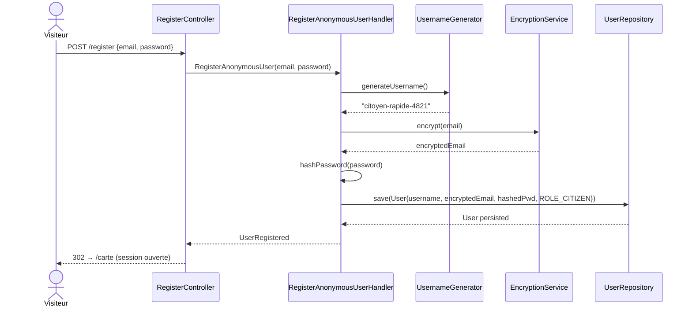

---

### SD-02 — Création d'un signalement

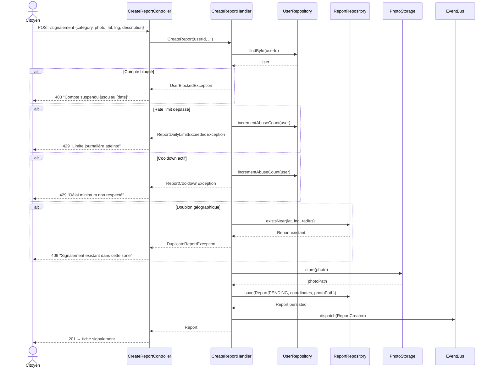

---

### SD-03 — Vote communautaire et effets Wilson

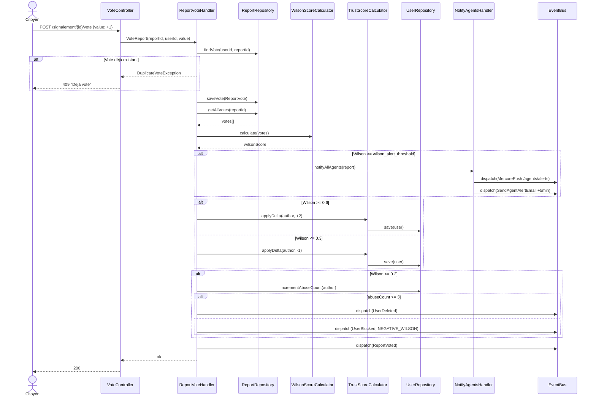

---

### SD-04 — Validation terrain et clôture par un agent

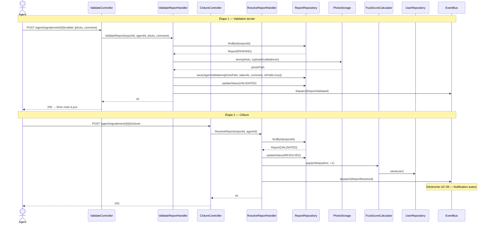

---

### SD-05 — Résolution par vote citoyen

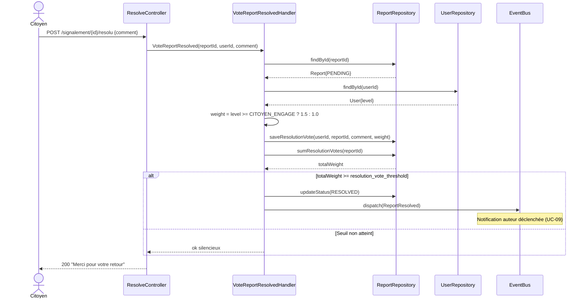

---

### SD-06 — Blocage d'un utilisateur

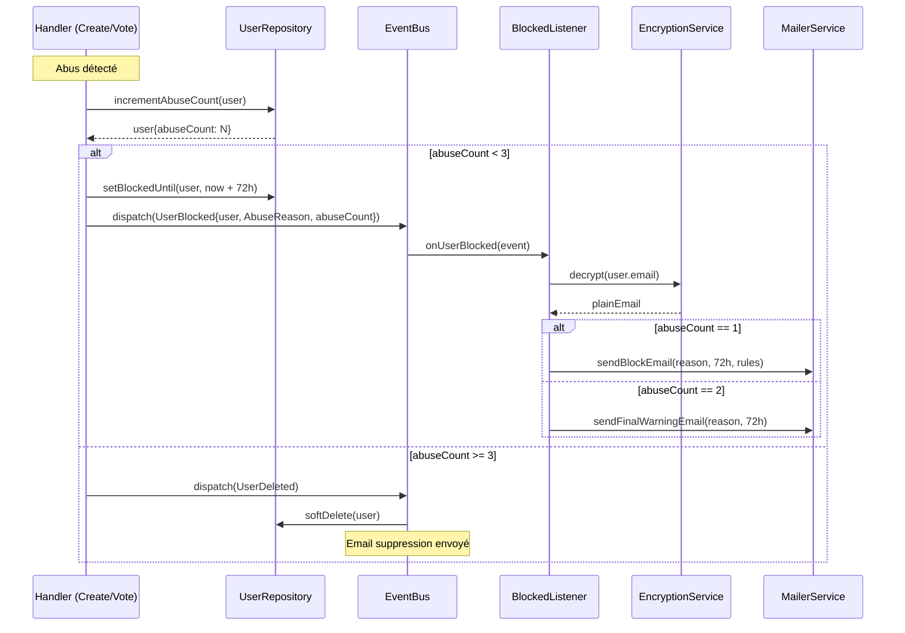

---

### SD-07 — Notification de clôture (Mercure + email fallback)

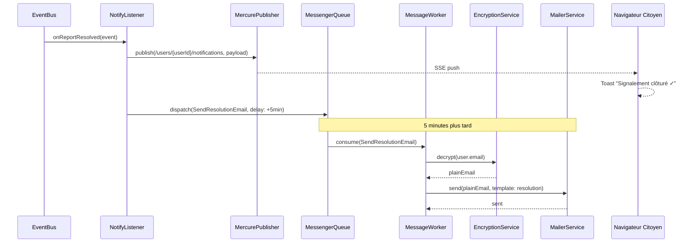

---

### SD-08 — Rejet par un agent

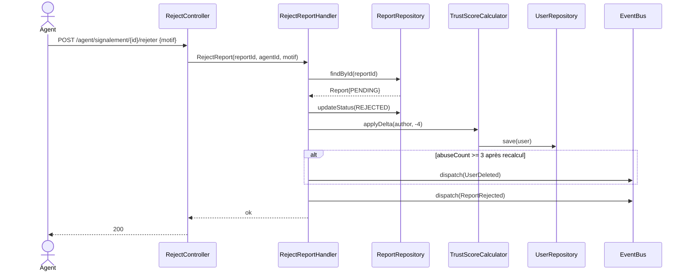

---

## 16. Diagrammes d'état

### ST-01 — Cycle de vie d'un signalement

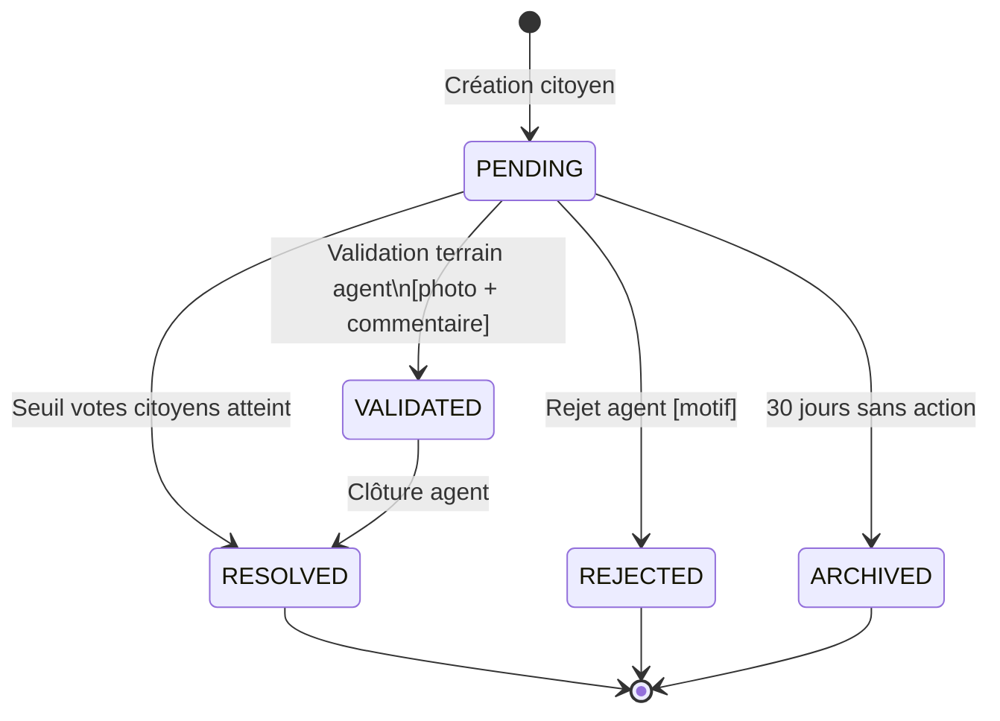

---

### ST-02 — Cycle de vie d'un utilisateur

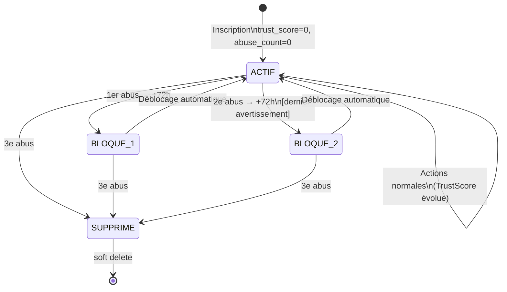

---

### ST-03 — Évolution du TrustScore / Niveau citoyen

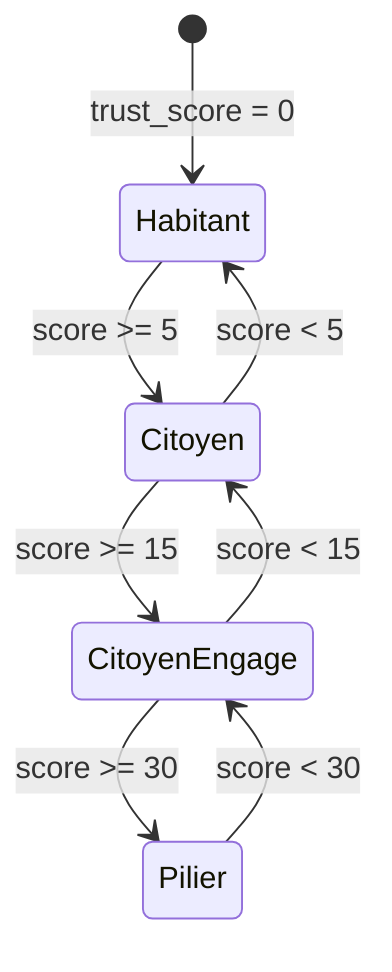

---

## 17. Ordre de développement — MVP

1. **Domain** — ValueObjects, Enums, Entités, Events, Exceptions, Interfaces Repository
2. **Application** — Commands et Handlers
3. **Infrastructure Persistence** — Doctrine + PostGIS, Repositories
4. **Infrastructure Notification** — Mercure, Mailer, Messenger
5. **Infrastructure Http** — Controllers ADR, Twig, Stimulus (GPS + caméra)
6. **Backoffice Agent** — Dashboard, validation terrain, clôture
7. **Backoffice Admin** — Gestion users, export, configuration
8. **PWA** — Manifest, Service Worker

---

## 18. Points d'attention techniques

- **PostGIS** : `ST_DWithin` avec cast `::geography` pour calcul en mètres réels
- **Email chiffré** : déchiffré uniquement à l'envoi, jamais loggué
- **Wilson Score** : jamais persisté en base, recalculé à la demande
- **CitizenLevel** : dérivé du TrustScore, jamais stocké en base
- **Suppression compte** : soft delete (`deleted_at`) pour intégrité référentielle
- **Mercure** : topics `/users/{id}/notifications` et `/agents/alerts`
- **Photos** : dossiers séparés `/uploads/reports/` et `/uploads/validations/`
- **Messenger** : messages différés pour emails fallback (5 min)
- **Scheduler** : archivage quotidien, heure creuse (02h00 recommandé)
- **RGPD** : purge physique planifiée des comptes soft-deleted
- **Alerte agents** : une seule par signalement même si Wilson repasse le seuil
- **Rejet agent** : motif interne, jamais exposé en public ni à l'auteur
- **Vote résolution** : pondération niveau appliquée serveur, jamais exposée
